<div align="center">

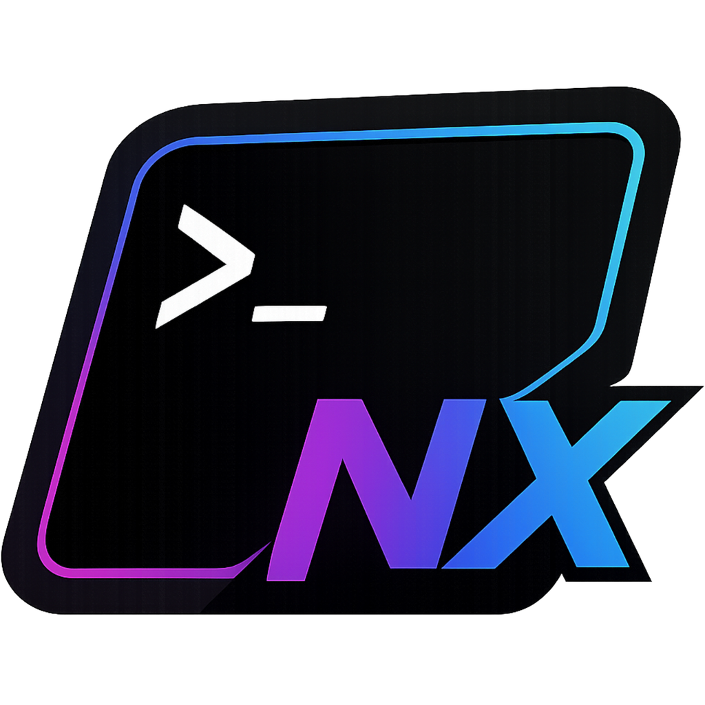

# NexTerm

**The modern, AI-powered terminal for Windows — free, private, and built from scratch.**

🤖 *Built-in AI chat with terminal context · SSH/SFTP · Recording · Snippets · 19 themes · Workspaces — all in one installer.*

[](https://github.com/rajendra7169/NexTerm/releases/latest)
[](LICENSE)
[](https://www.electronjs.org/)

A daily-driver Windows terminal that pulls in the best ideas from iTerm2, Windows Terminal, Warp, and Tabby — and ships them all for free in a single installer.

</div>

---

## 📸 Screenshots

<div align="center">

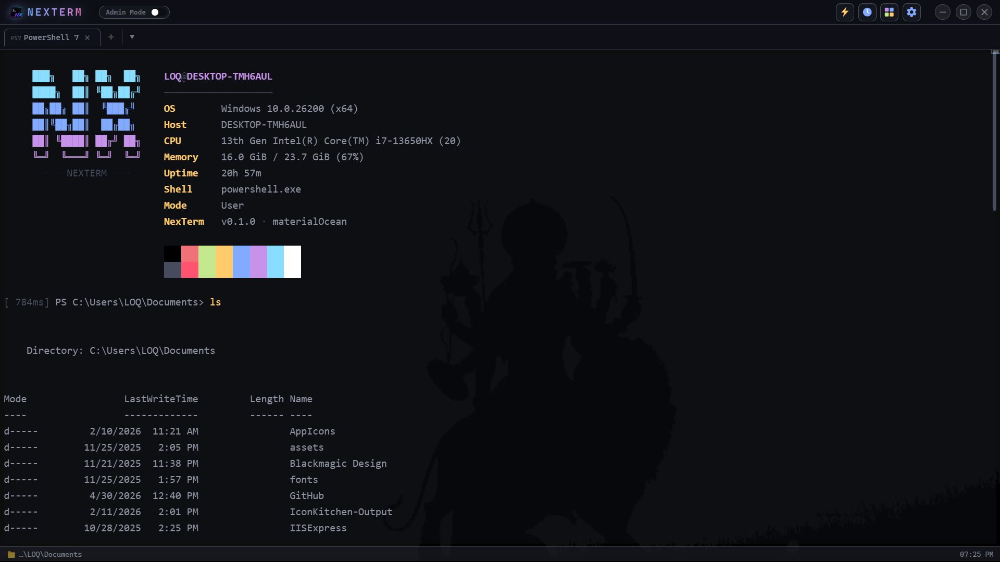

*Default view — ASCII banner, system info, Material Ocean theme, command timer, status bar*

</div>

<table>
  <tr>
    <td width="50%">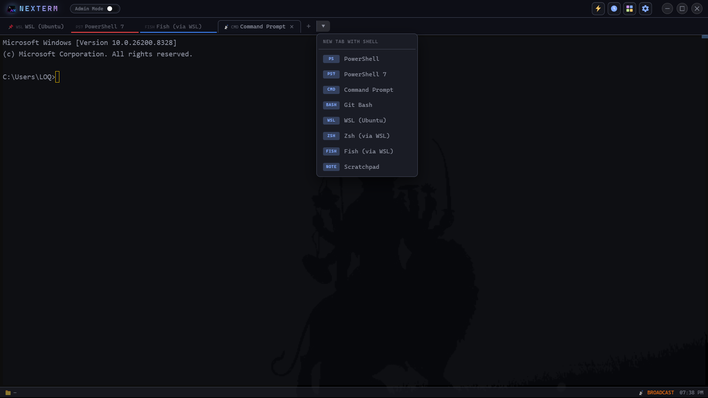</td>
    <td width="50%">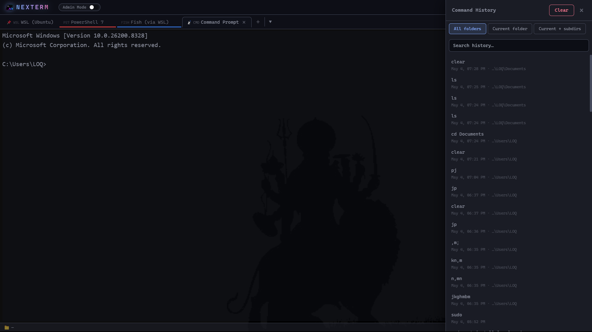</td>
  </tr>
  <tr>
    <td align="center"><strong>Multiple shells</strong><br/><sub>PowerShell, CMD, Git Bash, WSL, Zsh & Fish via WSL, Scratchpad</sub></td>
    <td align="center"><strong>Command history</strong><br/><sub>Cross-shell, scoped to folder / subdirs / all, click to re-run</sub></td>
  </tr>
  <tr>
    <td>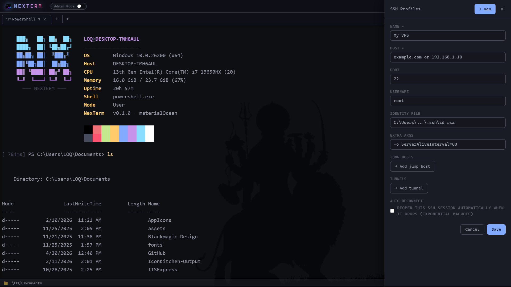</td>
    <td>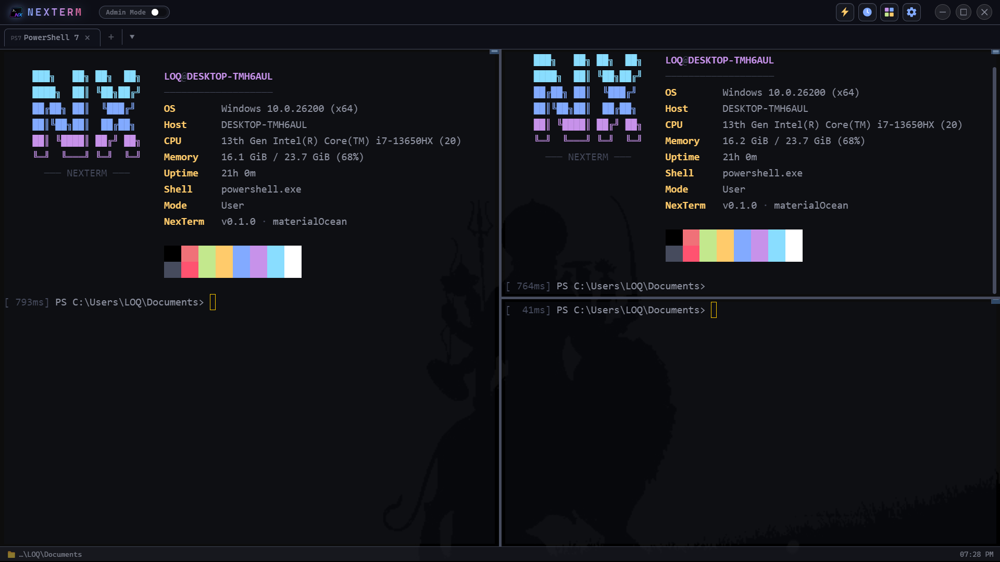</td>
  </tr>
  <tr>
    <td align="center"><strong>SSH Profiles</strong><br/><sub>Tunnels (-L/-R/-D), jump-host chains, auto-reconnect</sub></td>
    <td align="center"><strong>Pane splits</strong><br/><sub>Side-by-side / top-bottom; broadcast input across all</sub></td>
  </tr>
  <tr>
    <td>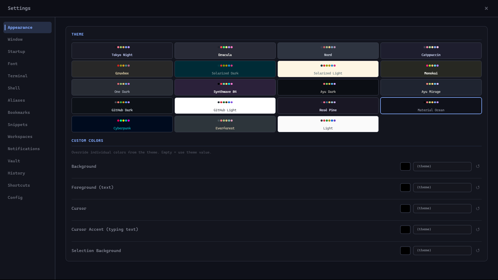</td>
    <td>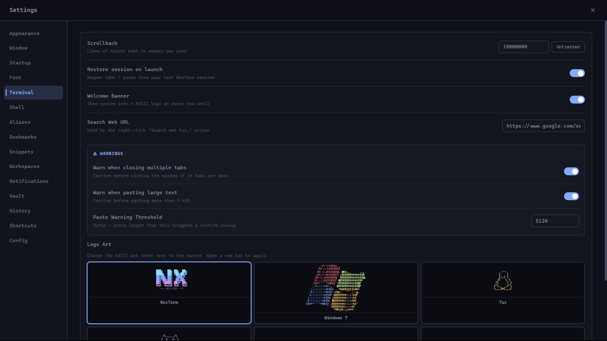</td>
  </tr>
  <tr>
    <td align="center"><strong>19 themes</strong><br/><sub>Tokyo Night, Dracula, Gruvbox, Solarized, Material Ocean…</sub></td>
    <td align="center"><strong>Window settings</strong><br/><sub>Status bar, mini-map, animated banner, Quake mode, etc.</sub></td>
  </tr>
  <tr>
    <td>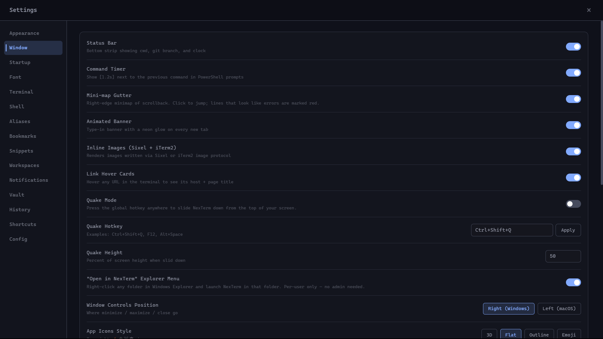</td>
    <td>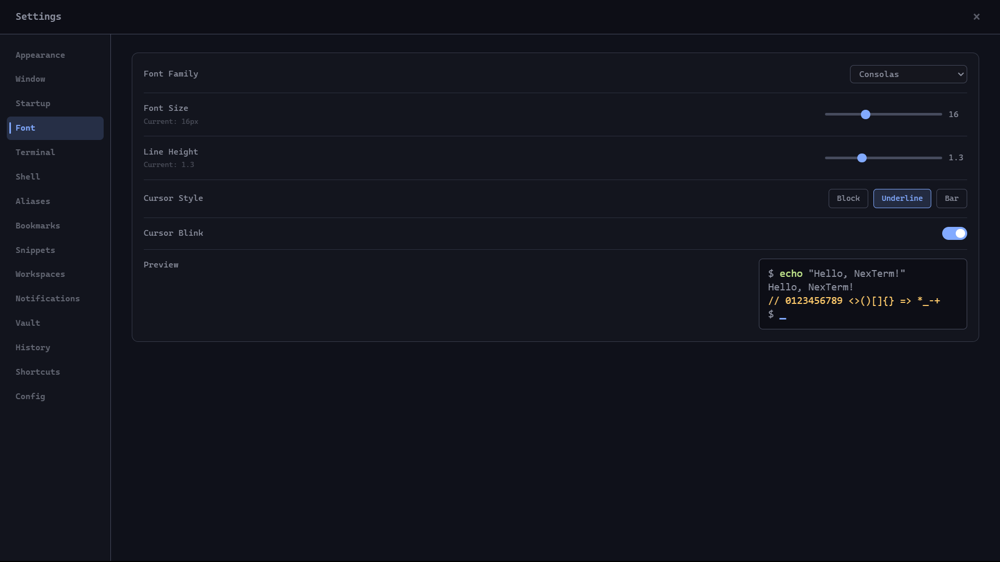</td>
  </tr>
  <tr>
    <td align="center"><strong>Terminal settings</strong><br/><sub>Scrollback, banner, paste warnings, ASCII logo picker</sub></td>
    <td align="center"><strong>Font settings</strong><br/><sub>Family, size, line height, cursor style + live preview</sub></td>
  </tr>
</table>

<div align="center">

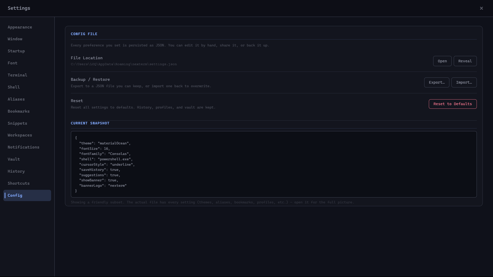

*Every preference is just JSON — open it, edit by hand, share, back up, or import a friend's config*

</div>

---

## ✨ Quick install

1. Grab the latest **`NexTerm-Setup-x.y.z.exe`** from the [**Releases page**](https://github.com/rajendra7169/NexTerm/releases/latest).
2. Run the installer (no admin rights required for per-user install).
3. Launch **NexTerm** from the Start Menu.

> Windows 10/11, x64. The installer is multi-step (Welcome → License → Install dir → Finish) with the NexTerm logo on the wizard sidebar.

---

## 🎯 Why NexTerm?

Most "free" Windows terminals are either bare-bones or have feature paywalls hiding behind subscriptions. NexTerm bundles everything serious developers actually use — SSH profiles, SFTP, port forwarding, jump-hosts, broadcast input, session recording — into one installer. No accounts. No telemetry. No ads.

---

## 🚀 Features

### 🤖 AI Assistant — built right into the terminal

NexTerm has a **side-panel AI chat** that knows what's on your terminal. Press **`Ctrl+Shift+A`** anywhere → chat panel slides in next to your shells, resizing the terminal area (it doesn't overlay).

**What it does**

- **Sees your terminal automatically** — captures the last 30 lines of your active pane on demand, so you can ask *"what does this error mean?"* without copy-pasting anything
- **Conversational memory** — every chat is saved to a local SQLite database. The AI remembers what you said earlier in the conversation
- **History dropdown** — resume any previous conversation, rename, delete; full search across all chats
- **Multi-turn** — ask follow-ups, request rewrites, dig into output
- **Code-block actions** — every code fence in the AI's reply gets **Copy / Insert / ▶ Run** buttons. One click and the suggested command lands in your terminal
- **Attach files for context** — drag any file (text, code, log, config, PDF, image up to 2 MB) into the chat; the AI uses it
- **Resizable side panel + fullscreen toggle** — drag the left edge, or hit ⛶ to expand chat across the whole window

**Three ways to run the model, all free**

| Mode | What it is | Setup | Privacy |
|---|---|---|---|
| **☁ Cloud (free tiers)** | Groq, Gemini, Cerebras, OpenRouter — all offer free, no-credit-card tiers | Paste a free API key | Prompt + cwd sent to provider |
| **💻 Local (Ollama)** | Runs Llama, Qwen, Mistral, Gemma on your own machine | One-click auto-install of Ollama + one-click model pull from inside Settings | 100% on-device |
| **🛠 Right-click → ✨ Explain & Fix** | Selects the last failing command + output, AI explains and offers a runnable fix | Same as above | Same as above |

**API keys never touch `settings.json`** — they're encrypted with DPAPI (Electron `safeStorage`) and stored in NexTerm's vault.

**Hardware-aware** — Settings → AI detects your CPU/RAM/GPU and recommends the right model tier (S/A/B/C/D) so a low-end laptop doesn't waste hours pulling a 70B model that won't run.

**Privacy controls** — toggle individual context bits (cwd, last command, redact env vars, redact home path). Local mode never sends anything off your machine.

### 🪟 Window & UX
- **Tabs and splits** — drag-to-reorder, pin tabs, color-code per project, close protection on multi-tab close
- **Pane splits** — vertical (`Ctrl+Shift+D`) and horizontal (`Ctrl+Shift+E`) inside any tab
- **Quake mode** — global hotkey slides NexTerm down from the top of your screen, like a classic FPS console
- **Drag-drop files** — drop any file onto a pane to paste its quoted path; auto-converts `C:\…` → `/mnt/c/…` for WSL panes
- **"Open in NexTerm here"** — Windows Explorer right-click integration (per-user, no admin)
- **Status bar** — current cwd, git branch + dirty marker, broadcast indicator, clock
- **12 window-control styles** (Windows / macOS-mimic / minimal / glass / liquid / etc.)

### 🐚 Shells
- **PowerShell 7 / 5, CMD, Git Bash, WSL** — first-class support for all
- **WSL distro install panel** — if you pick WSL with no distro, NexTerm offers to install Ubuntu or Debian inline
- **Zsh / Fish via WSL** — and if those binaries aren't in your distro, NexTerm offers `sudo apt install` inline
- **PowerShell init injection** — banners, aliases, bookmarks, OSC 7 cwd tracking, all baked in
- **Auto-fallback** — if your default shell is missing on disk, NexTerm picks a working one without crashing

### 🌐 SSH & Remote
- **SSH profiles** — host, port, username, identity file, extra args
- **Port forwarding UI** — `-L`/`-R`/`-D` rows you flip on/off without memorizing flags
- **Jump-host chains** — define `proxyJump` per profile; NexTerm builds the `-J user@bastion,…` argument for you
- **Auto-reconnect** — exponential backoff (1s → 30s, 8 tries) when an SSH session drops
- **SFTP side panel** — open an SSH tab and press `Ctrl+Shift+B`. File browser slides in: navigate, drag-drop upload from OS, download, delete. Built on `ssh2`

### 📼 Productivity
- **Command palette** (`Ctrl+Shift+P`) — fuzzy-pick any action
- **Session record/replay** — record any tab to a `.cast` file (asciinema v2 compatible). Replay to any pane with original timing. Share with `asciinema-player` or GitHub READMEs
- **Snippet library** (`Ctrl+Shift+I`) — saved command fragments with `${name:default}` placeholders. Fuzzy-pick → fill in params → paste
- **Find across all tabs** (`Ctrl+Shift+F`) — searches every open pane's scrollback. Click a result → switches tab + scrolls to line
- **Save terminal output** (`Ctrl+Shift+S`) — dump scrollback to a `.txt` file
- **Long-command notifications** — system toast when commands take > 30s and the window isn't focused
- **Command timer** — every PowerShell prompt shows `[1.2s]` for the previous command
- **Smart `cd` history** — type `cd nx` → fuzzy-jumps to your most-frequented dir matching `nx` (zoxide-style, no install)
- **Scratchpad pane** — non-shell text pane for notes that survive across sessions
- **`.nexterm.yml` workspaces** — drop a workspace file in any folder; NexTerm spawns N tabs (cwd + auto-run command) on open
- **Broadcast input** — type into one pane, mirror keystrokes to every pane in the tab (great for fleet SSH)
- **Multi-cursor lite (`Ctrl+D`)** — make a selection, press `Ctrl+D` to jump to next occurrence

### 🎨 Visual & Themes
- **19 built-in themes** — Tokyo Night, Dracula, Gruvbox, Solarized, GitHub, Nord, One Dark, etc.
- **Live theme tweaks** — override any background / foreground / cursor / selection color
- **Inline images** — Sixel + iTerm2 image protocol via `@xterm/addon-image`
- **Hover cards on URLs** — hover a link → small card with host + page `<title>`
- **Mini-map gutter** — right-edge minimap of scrollback. Click to jump. Lines matching `error`/`fail`/`exception` glow red
- **Animated banner** — typed-in figlet logo with neon glow on every new tab
- **Background image / blur** — Mica, Acrylic, Tabbed (Win11), or upload your own image with adjustable dim
- **Custom logos** — pick from 12 built-in ASCII logos or render your own text in figlet
- **Wheel zoom** — `Ctrl+Scroll` for font, `Ctrl+Shift+Scroll` for window opacity

### 🔐 Security & Storage
- **Secrets vault** — encrypted with Electron `safeStorage` (DPAPI under the hood). Inject as env vars at PTY spawn
- **Per-project aliases** — define aliases that only activate inside specific paths
- **Directory bookmarks** — `goto <name>` from PowerShell jumps to the bookmarked path
- **Local SQLite** — history, profiles, secrets all in `%APPDATA%\NexTerm\nexterm.db`. Yours, never sent anywhere
- **Admin Mode toggle** — flip between user and elevated mode without restarting; UAC handles the prompt

### 🔍 History & Search
- **Cross-shell history** — every command from every tab in one searchable list
- **Per-folder scope** — filter history to current cwd, current cwd + subdirs, or all
- **Click-to-run** — pick any past command and re-run in the active pane

### ⚙️ Customizable
- **All shortcuts rebindable** — `Ctrl+T`, `Ctrl+Shift+W`, `Ctrl+F`, `Ctrl+H`, `Ctrl+,`, `Ctrl+Shift+I/B/F/S`, etc.
- **Settings export/import** — share your full setup as JSON
- **Run on Windows startup** — opt-in
- **Run in background** — close to system tray, restore instantly

---

## ⌨️ Keyboard shortcuts (defaults)

| Action | Shortcut |
|---|---|
| New tab | `Ctrl+T` |
| Close pane / tab | `Ctrl+Shift+W` |
| Split right / down | `Ctrl+Shift+D` / `Ctrl+Shift+E` |
| Next / previous tab | `Ctrl+Tab` / `Ctrl+Shift+Tab` |
| Jump to tab N | `Ctrl+1` … `Ctrl+9` |
| Command palette | `Ctrl+Shift+P` |
| AI Chat panel | `Ctrl+Shift+A` |
| Snippets | `Ctrl+Alt+S` |
| Find in tab | `Ctrl+F` |
| Find across all tabs | `Ctrl+Shift+F` |
| Save scrollback | `Ctrl+Shift+S` |
| SFTP panel | `Ctrl+Shift+B` |
| SSH Profiles | `Ctrl+Shift+S` |
| History | `Ctrl+H` |
| Settings | `Ctrl+,` |
| Always on top | `Ctrl+Shift+T` |
| Quake mode toggle | `Ctrl+Shift+Q` (when enabled) |
| Select next match | `Ctrl+D` (with selection) |

All rebindable in **Settings → Shortcuts**.

---

## 📋 Workspace file example

Drop `.nexterm.yml` into any folder, then "Open in NexTerm here" loads the whole layout:

```yaml
tabs:
  - name: Server
    cwd: ./server
    command: npm run dev
  - name: Client
    cwd: ./client
    command: npm run dev
  - name: DB
    cwd: .
    command: docker compose logs -f db
  - name: Notes
    shell: pwsh.exe
```

---

## 🛠️ Build from source

```bash
git clone https://github.com/rajendra7169/NexTerm.git
cd NexTerm
npm install
npm run dev
```

To produce a Windows installer:

```bash
npm run build           # bundle main, preload, renderer
npx electron-builder --win
```

The signed-style installer lands in `release/NexTerm-Setup-<version>.exe`.

### Stack

- **Electron 30** + electron-vite + electron-builder
- **React 18** + Zustand
- **xterm.js v5** (with fit / search / web-links / image addons)
- **node-pty** for the PTY layer
- **better-sqlite3** for history / profiles / secrets
- **ssh2** for SFTP

---

## 🧱 Project structure

```
src/
├── main/          # Electron main process (PTY, IPC, SQLite, SSH/SFTP, banners)
├── preload/       # contextBridge exposing window.nexterm.* to renderer
└── renderer/
    └── src/
        ├── App.jsx
        ├── store/             # Zustand store
        ├── themes/            # 19 themes
        ├── components/        # Terminal, TabBar, TitleBar, Settings, etc.
        ├── shortcuts.js       # action registry
        └── styles/index.css
build/            # icons + NSIS sidebar/header bitmaps
```

---

## 📜 License

NexTerm is licensed under the **[PolyForm Noncommercial License 1.0.0](LICENSE)**.

In plain English:

- ✅ **Free to use** for personal, hobby, study, research, and any other non-commercial purpose
- ✅ **Free for charities, schools, public-research, and government institutions**
- ✅ **Free to fork, modify, and share** non-commercially
- ❌ **No commercial use** — you may not sell, bundle, host, or monetize NexTerm or any work based on it
- ❌ **No commercial redistribution** — including paid SaaS, paid support, or selling modified copies

If you'd like to use NexTerm commercially, please contact the author for a separate commercial license.

NexTerm is built and maintained by **Rajendra Pandey**.
Bugs, features, ideas → [open an issue](https://github.com/rajendra7169/NexTerm/issues).
